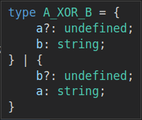
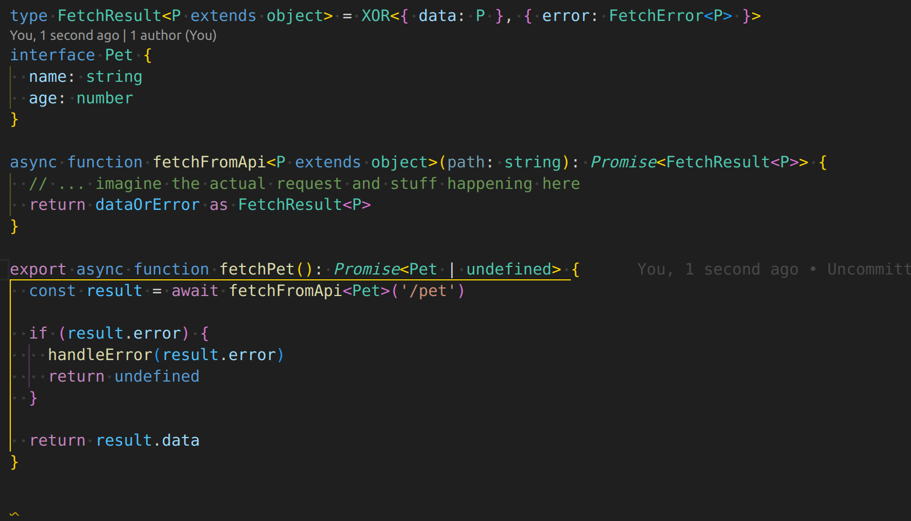

[](https://www.npmjs.com/package/ts-xor)
[](LICENCE.md)

[](https://npm-stat.com/charts.html?package=ts-xor&from=2019-02-22)
[](https://npm-stat.com/charts.html?package=ts-xor&from=2019-02-22)
[](https://github.com/maninak/ts-xor/network/dependents)
[](https://github.com/maninak/ts-xor/stargazers)

[](https://bundlephobia.com/result?p=ts-xor)
[](https://github.com/maninak/ts-xor/blob/87aa237a1b246efa4e8028d89dc7168ba4c4fd84/package.json#L30)

# ts-xor

The npm package `ts-xor` introduces the new mapped type `XOR` that helps you compose your own custom TypeScript types containing mutually exclusive object keys.

## Description

### TL;DR

`ts-xor` implements the well-known [exclusive or](https://en.wikipedia.org/wiki/Exclusive_or) (a.k.a. XOR) logical operator from boolean algebra:

| A | B | XOR | union operator (`\|`) | `ts-xor` |
| :-: | :-: | :-: | :-: | :-: |
| 0 | 0 | 0 | 0 ✅ | 0 ✅ |
| 0 | 1 | 1 | 1 ✅ | 1 ✅ |
| 1 | 0 | 1 | 1 ✅ | 1 ✅ |
| 1 | 1 | 0 | 1 ❌ | 0 ✅ |

### Why isn't TypeScript's built-in union operator (`|`) enough?

Typescript's union operator allows combining two object types `A` and `B`, into a _superset_ type C which _can_ contain all the keys of both `A` and `B`.

But sometimes the requirements dictate that we combine two types with _mutually exclusive_ keys.

For example: assume two objects with with keys `A.a` and `B.b`. Given `type C = A | B` then we want to impose the restriction that we can set _either_ `C.a` _or_ `C.b` _but never both_ AND _always at least one of the two_!

[Typescript does not have this feature built-in.](https://github.com/Microsoft/TypeScript/issues/14094)

### Explained by example

If we use the union operator

```ts
type A_OR_B = A | B
```

then the derived type is shown in VS Code like so:


Whereas if we use `XOR`:

```ts
type A_XOR_B = XOR<A, B>
```

then the derived type is shown quite differently in VS Code:



### How it works

Notice in the example above, that when using `XOR`, each union branch of the resulting type contains all keys of one source type plus all keys of the other. At the same time, in each variant, those keys of the other type are defined as _optional_ while additionally they are also typed as _undefined_.

This trick will not only forbid having keys of both source types defined at the same time (since the type of each key is explicitly `undefined`), but also _allow_ us to not need to define all keys all of the time since each set of keys is optional on each variant.

>_Fun fact: The actual TypeScript code for `XOR` [is generated programmatically](https://github.com/maninak/ts-xor/pull/27) using the TypeScript Compiler API._ 🦾

## Installation

In your typescript powered, npm project, run:

```sh
npm install -D ts-xor
```

## Usage

```typescript
import type { XOR } from 'ts-xor'

interface A { a: string }
interface B { b: string }

let test: XOR<A, B>

test = { a: '' }         // OK
test = { b: '' }         // OK
test = { a: '', b: '' }  // error
test = {}                // error
```

### XORing more than two types

If you want to create a type as the product of the logical XOR operation between multiple types (more than two and even up to 200), then just pass them as additional comma-separated generic params.

```typescript
let test: XOR<A, B, C, D, E, F>
```

`ts-xor` can easily handle up to 200 generic params. 💯

### Pattern 1: Typing a fetcher returning data XOR error

Using `XOR` we can type a function that returns either the data requested from an API or a response object like so:

```ts
type FetchResult<P extends object> = XOR<
  { data: P },
  { error: FetchError<P> },
>
```

Now TypeScript has all the necessary information to infer if the `FetchResult` contains a `data` or `error` key _at compile time_ which results in very clean, yet strictly typed, handling code.



### Pattern 2: Typing an API's response shape

Let's assume that we have the following spec for a weather forecast API's response:

1. A weather forecast object _always_ contains the `id` _and_ `station` members
2. A weather forecast object _always_ contains either a member `rain` _or_ a member `snow`, but _never_ both at the same time.
3. The rain, snow members are objects containing additional forecast accuracy data
4. The rain, snow members _always_ contain either a member `1h` or a member `3h` with a number value, but _never_ both keys at the same time.

```typescript
type ForecastAccuracy = XOR<{ '1h': number }, { '3h': number }>

interface WeatherForecastBase {
  id: number
  station: string
}

interface WeatherForecastWithRain extends WeatherForecastBase {
  rain: ForecastAccuracy
}

interface WeatherForecastWithSnow extends WeatherForecastBase {
  snow: ForecastAccuracy
}

type WeatherForecast = XOR<WeatherForecastWithRain, WeatherForecastWithSnow>

const test: WeatherForecast = {
  id: 1,
  station: 'Acropolis',
  // rain: { '1h': 1 },           // OK
  // rain: { '2h': 1 },           // error
  // rain: { '3h': 1 },           // OK
  // rain: {},                    // error
  // rain: { '1h': 1 , '3h': 3 }, // error
  // lel: { '3h': 1 },            // error
  // rain: { '3h': 1, lel: 1 },   // error
  // snow: { '3h': 1 },           // OK
                                  // error when BOTH `rain` AND `snow` keys are defined at the same time
}
```

## Tests and coverage

The library `ts-xor` is fully covered with smoke, acceptance and mutation tests against the typescript compiler itself. The tests can be found inside the [`test`](https://github.com/maninak/ts-xor/tree/master/test) folder.

To run all tests locally, execute the following command inside your git-cloned `ts-xor` folder:

```sh
npm run test
```

## Licence

Distributed under the MIT license. See [`LICENSE.md`](./LICENCE.md) for more information.

## Links

This library is [published on NPM](https://www.npmjs.com/package/ts-xor).

🫶 Follow me on [Twitter](https://twitter.com/maninak_).
